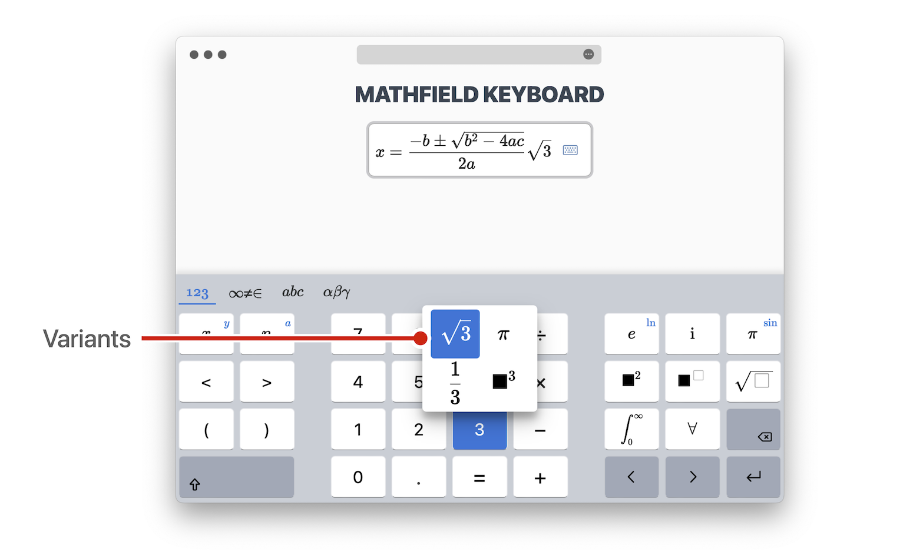
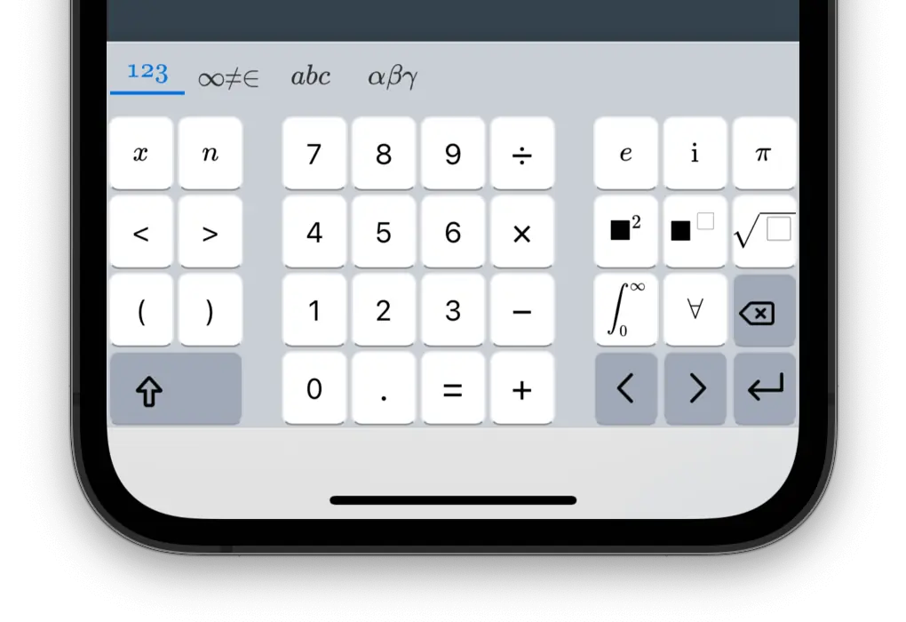
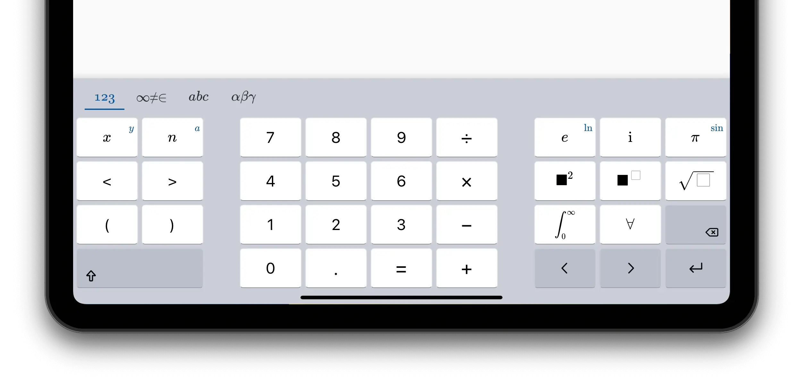
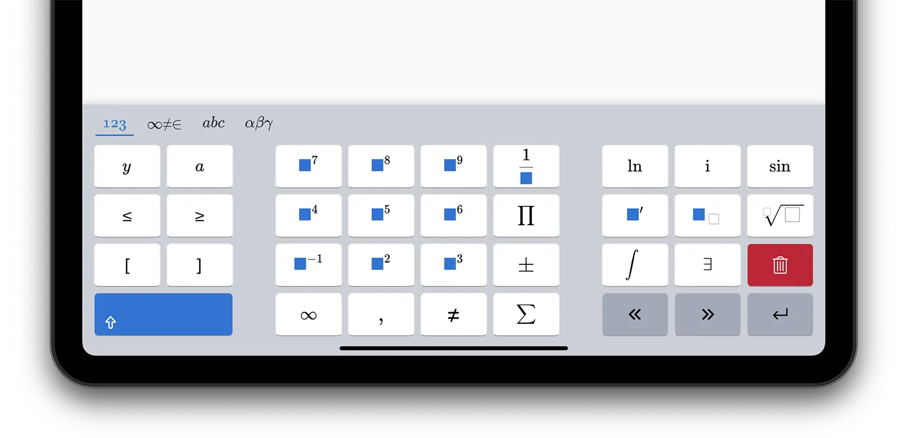
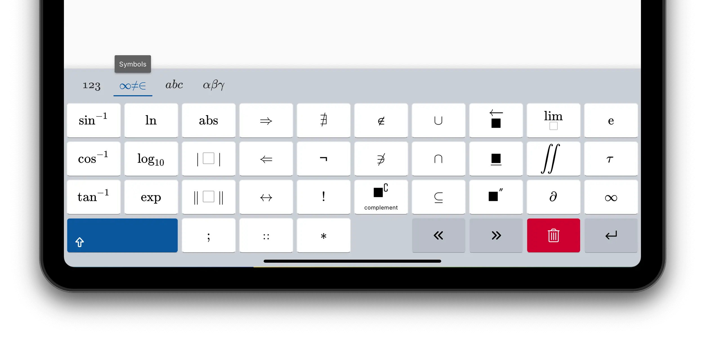
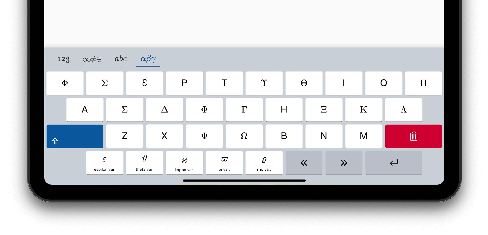

<Intro>
Typing math requires access to many special symbols. While [keyboard 
shortcuts and inline shortcuts](/mathfield/guides/shortcuts) can help when a 
physical keyboard is available, touch-enabled devices without a physical 
keyboard attached need another solution.
</Intro>

The **math virtual keyboard** is a keyboard displayed on screen that gives 
access to specialized symbols for math input with only a tap.

### Layout Selector

The math keyboard includes multiple **layouts** which you can select with the 
layout selector.

The default layouts include the most common math symbols. They are: 
**numeric**, **symbols**, **alphabetic** and **greek letters**.

<ReadMore path="/mathfield/guides/virtual-keyboards/" >
These layouts can be customized to fit specific needs. Learn more about **customizing virtual keyboards**.
</ReadMore>

### Undo/Redo/Paste

The **Editing Toolbar** display icons for common editing functions: **Undo**, 
**Redo**, **Paste**, **Cut** and **Copy**.

If you have a physical keyboard attached, these commands can be invoked 
with their corresponding keybindings: <kbd>Ctrl/Command</kbd>+<kbd>Z</kbd>,
<kbd>Ctrl/Command</kbd>+<kbd>Y</kbd>, <kbd>Ctrl/Command</kbd>+<kbd>V</kbd>,
<kbd>Ctrl/Command</kbd>+<kbd>X</kbd> and <kbd>Ctrl/Command</kbd>+<kbd>C</kbd>.

### Shift Key

Press the **Shift Key** <kbd>⇧</kbd> to access alternative symbols. The 
keyboard updates when the key is pressed to reveal the symbols.

If you have a physical keyboard, you can also press the <kbd>SHIFT</kbd> or 
<kbd>CAPSLOCK</kbd> key on the physical keyboard.

The symbol corresponding to the shifted variant is displayed
in the top right corner of some keys. Some keys have a shifted variant even
though they may not include a top-right label.

### Variants

A key **variant** is a symbol that can be accessed by a **long press** on a keycap.
The variant is often related to the original symbol.

**To display variants related to a keycap**, press and hold the keycap.

Many keycaps have variants, but a few don't.

### Numeric Layout

### Symbols Layout

### Alphabetic Layout

### Greek Layout

