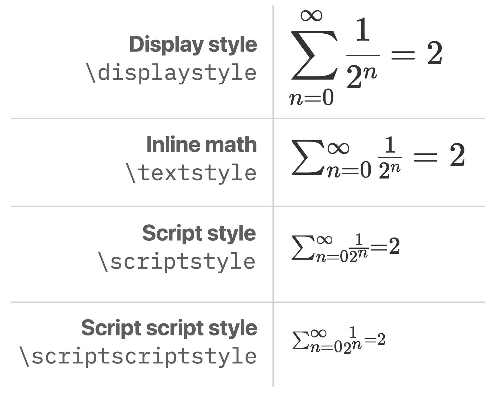

# Customizing a Mathfield

<Intro>
The appearance and behavior of the mathfield is highly customizable.

In this section we'll go over some of the ways a mathfield can be customized.
</Intro>

## Styling

**To style the mathfield** define a CSS rule targeting the mathfield or use the 
`style` attribute of the `<math-field>` element.

CSS attributes can be used to modify the appearance of the mathfield in many ways, for 
example changing the base font size or adding a border around it.

**To remove the border around the mathfield**, set the
`border` property to `none` or `0`.

**To change the background color of the mathfield**, use the `background` property.

```live
:::html
<math-field style="border: none; background: #d8f0ff">
    x=\frac{-b\pm \sqrt{b^2-4ac}}{2a}
</math-field>
```


**To display the mathfield as a block element**, rather than an inline element, 
add an attribute `style="display: block"`

```live mark-html-line="5"
:::html
<p>Answer: 
  <math-field style="font-size:1.2rem">42</math-field>.
</p>
<p>Answer: 
  <math-field style="font-size:2rem; display: block">3.1415</math-field>
</p>
```


### CSS Variables

**To customize the appearance of the mathfield**, use the following CSS
variables (custom properties) in a ruleset that applies to the mathfield element.

```css
math-field {
 --smart-fence-color: red ;
}
```

Although CSS styles are "invisible" to custom components, CSS variables are 
"passed through" and will affect the content of the `<math-field>` custom component.

Set these CSS variables on any selector that applies to the
`<math-field>` element you want to customize, for example, `body`. 

Alternatively these CSS variables programatically can be set programmatically:

```js
document.body.style.setProperty("--smart-fence-color", "red");
```

<div className="symbols-table first-column-header" style={{"--first-col-width":"34ch"}}>

| CSS Variable | Usage |
|:---|:---|
| `--primary` | Primary accent color, used for example keyboard toggle and menu glyphs and in the virtual keyboard |
| `--caret-color` | Color of the insertion point |
| `--selection-color` | Color of the content when selected |
| `--selection-background-color`| Background color of the selection | 
| `--contains-highlight-background-color` | Background color of items that contain the caret |
| `--placeholder-color` | Color of the placeholder symbol |
| `--placeholder-opacity` | Opacity (0-1) of the placeholder symbol |
| `--smart-fence-color` | Color of a smart fence (default is `current` color) |
| `--smart-fence-opacity` | Opacity of a smart fence (default is `50%`) |
| `--highlight-text` | The background color indicating the caret is in a text zone |
| `--text-font-family` | The font stack used for content in a text zone |
| `--latex-color` | The color of content in a LaTeX zone |
| `--correct-color`| Highlight color of a prompt when in the `"correct"` state| 
| `--incorrect-color`| Highlight color of a prompt when in the `"incorrect"` state | 

For color values, you can use any valid CSS color value, such as a color name,
or `transparent to remove the color.

**Note** To change the placeholder symbol, use the `mf.placeholderSymbol` property.


</div>
 


```live
:::html
<style>
math-field {
  --caret-color: red;
  --selection-background-color: lightgoldenrodyellow;
  --selection-color: darkblue;
}
</style>
<math-field>
    x=\frac{-b\pm \sqrt{b^2-4ac}}{2a}
</math-field>
```


<br/>

You can customize the appearance and zindex of the virtual keyboard panel
with some CSS variables associated with a selector that applies to the
virtual keyboard panel container.

Read more about [customizing the virtual keyboard appearance](/mathfield/guides/virtual-keyboards/#custom-appearance)


### Mathfield Parts

Because the mathfield is a custom element with a shadow DOM, its content
is not directly accessible to CSS rules outside of the shadow DOM.

However, there are a few parts that can be used to style the 
content of the mathfield using the `::part()` pseudo-element.

<div className="symbols-table first-column-header" style={{"--first-col-width":22+"ch"}}>

| Pseudo-element | Usage |
|:---|:---|
| `virtual-keyboard-toggle` | The virtual keyboard toggle button |
| `menu-toggle` | The menu toggle button |
| `content` | The math formula |
| `container` | The element containing the formula, the keyboard toggle and the menu toggle |
| `keyboard-sink` | The hidden element capturing the physical keyboard input |
| `placeholder` | The element containing the placeholder attribute when the mathfield is empty |
| `prompt` | The prompts (`placeholder{}`) inside the mathfield |

</div>

For example:

```css example
/* Right align the formula */
math-field::part(content) {
  text-align: right;
}

/* Right align the virtual keyboard toggle */
math-field::part(container) {
  flex-flow: row-reverse;
}

/* Hide the virtual keyboard toggle */
math-field::part(virtual-keyboard-toggle) {
  display: none;
}

/* Hide the menu toggle */
math-field::part(menu-toggle) {
  display: none;
}
```

**Note** When the menu toggle is hidden, the menu can still be opened by 
right-clicking on the mathfield. You can [customize the menu](/mathfield/guides/menu/) to change
this behavior.

### Placeholder

**To customize the placeholder text** set the `placeholder` attribute on the 
`<math-field>` element.

Note that the content of the `placeholder` attributed is interpreted as a
LaTeX string. To display it as regular text, use the `\text{}` command.

```live
:::html
<math-field placeholder="\text{Enter a formula}">
</math-field>
```

### Focus Ring

**To change the appearance of the focus ring**, use the `:focus-within` pseudo-element.

```live
:::html
<style>
  math-field:focus-within {
    outline: 4px solid #d7170b;
    border-radius: 4px;
    background: rgba(251,	187,	182, .1);
  }
</style>
<math-field>
    x=\frac{-b\pm \sqrt{b^2-4ac}}{2a}
</math-field>
```

:::warning

**Caution** Removing outlines in CSS creates issues for people navigating the web 
with a keyboard. However, you can change the appearance of the outline,
for example to indicate an error condition. If you remove the outline on the
mathfield, make sure to replace it with another indicator, for example
by displaying an outline on an enclosing element.

:::


## Math Display Options

The appearance of a formula, in an editable mathfield or as a static
representation, can be controlled with some of the following options:

### Color

**To change the foreground ("ink") and background ("paper") colors of a formula 
programmatically**, use the `mf.applyStyle()` function.

**To change the foreground color**, use the `\textcolor{}{}` command.
**To change the background color**, use the `\colorbox{}{}` command.

  
The first argument of these commands is a color specified as:
  - a RGB color using the standard CSS format (`#d7170b`)
  - a [CSS color name](https://developer.mozilla.org/en-US/docs/Web/CSS/color_value) (`goldenrod`)
  - one of the 68 colors from [dvips color name](https://ctan.org/pkg/colordvi) (`cadetblue`)
  - one of the 10 Mathematica color from `ColorData[97, "ColorList"]` (`m0` to `m9`)
  - a color defined using the syntax from the [`xcolor` package](http://mirror.jmu.edu/pub/CTAN/macros/latex/contrib/xcolor/xcolor.pdf), for example: `blue!20!black!30!green`

The following color names are recommended. They can be applied using the color 
keys in the virtual keyboard:


:::info[Note]

These colors have been carefully selected for a balanced representation of the range of 
hues on the color circle, with similar lightness and intensity. They will map to  different color values than the `dvips` colors of the same name.

:::

:::info[Note]

To have proper legibility based on usage, these color names will map to 
different values when used as a foreground color
and a background color. To use a specific color value, use a RGB color instead.

:::


:::info[Note]

**To customize how the color names are interpreted** provide a `colorMap`
or `backgroundColorMap` function.

:::

### Size

**To change the base font size**, set the `font-size` CSS property to the desired
value on the `mathfield` or static element.

Within a formula, the size can be specified from a font scale with 10 values, 
where 1 em is the base font size of the mathfield or static element.

<div className="symbols-table first-column-header" style={{"--first-col-width":"7ch"}}>

| `fontSize` | &nbsp;| LaTeX Command | 
|------:|:------|:----|
| 1 | 0.5 em | `\tiny` | 
| 2 | 0.7 em | `\scriptsize` | 
| 3 | 0.8 em | `\footnotesize` | 
| 4 | 0.9 em | `\small` | 
| 5 | 1 em | `\normalsize` or `\normal` | 
| 6 | 1.2 em | `\large` | 
| 7 | 1.44 em | `\Large` | 
| 8 | 1.728 em | `\LARGE` | 
| 9 | 2.074 em | `\huge` | 
| 10 | 2.488 em | `\Huge` | 

</div>

:::warning

In TeX, the sizing commands behave inconsistently when applied to math. 
Other implementations of TeX may also interpret the sizing commands 
differently.

:::

### Math Layout

**To control some aspects of the math typesetting**, change the mathstyle with 
the commands `\displaystyle`, `\textstyle`, `\scriptstyle`, `\scriptscriptstyle`.



The `displaystyle` style is most appropriate when there is plenty of space around
the  formula. Limits over large operators, such as `\sum` are displayed above 
and below the operator. There is a generous amount of space below the numerator 
and above the denominator of fractions, and around relational (`=`) and binary
(`+`) operators.

The `textstyle` style is useful when space is constrained or when displaying
a formula with some regular text around it. The limits of large operators 
are displayed after the operator. The numerator and denominator of fractions is
displayed using a smaller font size. However, the font-size for other characters
is not affected.

The `scriptstyle` and `scriptscriptstyle` are rarely needed explicitly. The 
content is laid out using a smaller font-size (70% and 50% of the base font-size,
respectively) and the spacing between operators is minimized. Note however
that these styles are used automatically in some situations. For example,
when using the `displaystyle` or `textstyle`, the limits of a large operator
or the superscript or subscript of a symbol are displayed using these styles.
Notice for example that `n=0` in `displaystyle` does not include space around
the `=` sign because the limit is displayed in `scriptstyle`.


**To set the default mathstyle of a mathfield**, set the `mf.defaultMode`
property or the `default-mode` attribute.

Set it to `"inline-math"` to use `textstyle` or `"math"` to use `displaystyle`.


```live mark-html-line="2"
:::html
<p>The answer is 
  <math-field default-mode="inline-math">
    x=\frac{-b\pm \sqrt{b^2-4ac}}{2a}
  </math-field>.
</p>
```

By default, the mathfield element is laid out on the page as an inline element
when in an inline context (when inside a `<p>` tag for example).

To get it laid out as a block element, set `display: block` on the mathfield. 


### Letter Shape Style

**To control which letters are automatically italicized**, set the `letterShapeStyle` property or `letter-shape-style` attribute.


<div className='symbols-table first-column-header'>

| `letterShapeStyle` | xyz    | ABC    | αβɣ    | ΓΔΘ   |
| :----------------- | ---    | ---    | ---    | ---   |
|              `iso` | _xyz_  | _ABC_  | _αβɣ_  | _ΓΔΘ_ |
|              `tex` | _xyz_  | _ABC_  | _αβɣ_  | ΓΔΘ   |
|           `french` | _xyz_  | ABC    | αβɣ    | ΓΔΘ   |
|          `upright` | xyz    | ABC    | αβɣ    | ΓΔΘ   |

</div>

In the [ISO](https://www.nist.gov/pml/special-publication-811) style, lower and
uppercase roman letter and lower and upper case greek letters are italicized 
when used as a variable. Mathematical constants such as \\(e\\) are written upright.

TeX has traditionally implemented a layout option that italicizes romman 
letters and lowercase greek letters, but not uppercase greek letters.

The French typographical convention is to only italicize lowercase roman letters.

The default letter shape style is `auto`: if the system locale is "french",
the `french` style is used, otherwise `tex` is used.


## Editing Options

The editing behavior of a mathfield can be customized by setting some 
properties on the mathfield, or the equivalent attributes on the 
`<math-field>` tag.

* `defaultMode`: 
  * `"inline-math"`: use inline math mode
  * `"math"`: use the display math mode
  * `"text"`: use the text mode  | 
* `removeExtraneousParentheses`: automatically remove extra parentheses around
a numerator or denominator
* `scriptDepth`: maximum levels of subscript or superscript. Set it to 0 to 
prevent the input of superscript and subscripts
* `smartFence`: automatically convert parentheses to `\left...\right` markup.
* `smartMode`: switch to text mode when text input is detected, for example 
when typing "if x > 0"
* `smartSuperscript`: automatically move out of a superscript when a digit is typed

These properties can also be passed as an argument to [`new MathfieldElement()`](/docs/mathfield/#(%22mathfield-element%22%3Amodule).MathfieldElement%3Aconstructor) when programmatically creating mathfield elements.

In the interactive code playground below, try some of these options. For example, 
in line 1 add the attribute `smart-mode=false`, then type some parentheses 
in the mathfield.

```line show-line-numbers mark-html-line="1"
:::html
<math-field smart-mode>
    x=\frac{-b\pm \sqrt{b^2-4ac}}{2a}
</math-field>

```
<br/>

<ReadMore path= "/mathfield/?q=EditingOptions">
See `EditingOptions` for more details about these and other available options<Icon name="chevron-right-bold" />
</ReadMore>


### Handling the Space Bar

In traditional math typesetting, spaces have no effect: the spacing of elements
in a formula is determined by the nature of the elements: numbers, punctuation,
relational, binary or unary operators, etc...

**To control spacing in a formula**, use some of the LaTeX spacing commands: `\quad`,
`\qquad`, `\!`, `\,` (thin space), `\:` (medium space), `\;` (thick space), `\enskip` or `\enspace`.

By default, pressing the spacebar when in math mode does not insert anything.

**To insert a LaTeX command when the spacebar is pressed**, set the value of the 
`mathModeSpace` property to that command:

```js
mf.mathModeSpace = '\\:';
```


### Turning off the LaTeX mode

Pressing the <kbd>\\</kbd> (backslash) or <kbd>ESC</kbd> key switches to the LaTeX mode where it 
is possible to enter raw LaTeX command. For users familiar with LaTeX, it is
a powerful way to enter or edit LaTeX in an expression. However, users
unfamiliar with LaTeX may be confused if they accidentally press those keys.

**To prevent the LaTeX mode from being enabled** intercept the trigger keys
and call `preventDefault().

```js
mf.addEventListener(
  'keydown',
  (ev) => {
    if (ev.key === '\\') {
      ev.preventDefault();
      mf.executeCommand(['insert', '\\backslash']);
    } else if (ev.key === 'Escape') ev.preventDefault();
  },
  { capture: true }
);
```


## Localization

The user interface of the mathfield is provided in english, arabic, german, 
greek, spanish, farsi, french, italian, japanese, polish and russian.

The language to use is detected automatically, but it can be overridden by
using the `MathfieldElement.locale` static property. Setting this property
will affect all mathfield elements on the page.

```live
:::js
await customElements.whenDefined('math-field');
const locale = MathfieldElement.locale;
console.log("Locale:", locale);
console.log(MathfieldElement.strings[locale.substring(0, 2)]);


:::html
<math-field id=formula>
    x=\frac{-b\pm \sqrt{b^2-4ac}}{2a}
</math-field>
```

### Decimal Marker

The world is
[about evenly split](https://en.wikipedia.org/wiki/Decimal_separator#/media/File:DecimalSeparator.svg)
between using a dot `.` or a comma `,` as a decimal marker.

**To change the marker used with decimal numbers** set the 
`MathfieldElement.decimalSeparator` property to `","` or `"."`.

When set to `","`, pressing the <kbd>,</kbd> key on a physical keyboard will insert a 
`{,}` LaTeX string, if in math mode and if before a digit. 

The LaTeX sequence `{,}` is traditionally used to correctly typeset the comma 
and ensure the correct amount of space around it. Without the `{}`, the `,` 
is interpreted as a delimiter and has excessive amount of space around it.

When set to `","`, the virtual keyboard is also changed so that the `.` 
keycap is  labeled `,` instead and contextually inserts a `{,}` when appropriate.

```live
:::js
await customElements.whenDefined('math-field');
MathfieldElement.decimalSeparator = ",";
:::html
<math-field id='formula'>
    x=\frac{-b\pm \sqrt{b^2-4ac}}{2a}
</math-field>
```


### Fraction Navigation Order

When using the arrow keys on the keyboard to navigate a fraction, the order in 
which the numerator and navigator are traversed can be customized.

**To change the keyboard navigation order of fractions** set the 
`MathfieldElement.fractionNavigationOrder` property.

The possible values are:
- `"numerator-denominator"`: first the elements in the numerator, then
  the elements in the denominator. This is the default behavior.
- `"denominator-numerator"`: first the elements in the denominator, then
  the elements in the numerator. In some East-Asian cultures, fractions
  are read and written denominator first (_fēnzhī_). With this option
  the keyboard navigation follows this convention.


```live
:::js
await window.customElements.whenDefined('math-field');
MathfieldElement.fractionNavigationOrder = "denominator-numerator";

:::html
<math-field>
    x=\frac{-b\pm \sqrt{b^2-4ac}}{2a}
</math-field>
```


## Sounds and Haptic Feedback

The mathfield provides some audio feedback when a key is pressed on the virtual 
keyboard or when an action cannot be performed, for example when trying to
delete when the mathfield is empty (the "plonk" sound).

The files for the sounds played by the mathfield should be located in a 
directory named `sounds` next to the mathfield library. If your bundler or 
asset management system require a different configuration you can specify 
where the sounds can be located using the `MathfieldElement.soundsDirectory` 
property.

```js
MathfieldElement.soundsDirectory = 
  "https://unpkg.com/mathlive/dist/sounds/";
```

Specific sounds can be disabeld or customized with the `MathfieldElement.keypressSound`
property.

```js
MathfieldElement.keypressSound = {
  spacebar: null,
  return: "./sounds/return.mp3",
  delete: null,
  default: null,
}
```

### Playing "Plonk" Sound

**To play the "plonk" sound** when an action cannot be performed, use `MathfieldElement.playSound('plonk')`.

```js
MathfieldElement.playSound('plonk');
```


### Disabling Sounds

**To turn off the sounds** set the `MathfieldElement.soundsDirectory` property to `null`.

```js
MathfieldElement.soundsDirectory = null;
```

### Haptic Feedback

When a key on the virtual keyboard is pressed, a small vibration is triggered
on devices that support it. This can be turned off by setting the
`MathfieldElement.keypressVibration` property to `false`.

```js
MathfieldElement.keypressVibration = false;
```

## Fonts

The content of the mathfield is displayed using a family of high-quality 
fonts based on the original Computer Modern font from TeX. The mathfield
will not display correctly using another font. 

By default, the directory containing the fonts is located next to the file 
containing the mathlive library. If your bundler or asset management system 
require a different configuration you can specify where the fonts can be 
located using the [`MathfieldElement.fontsDirectory`](mathfield/?q=fontsDirectory) 
property.

```live
:::style
.output:focus-within {
  outline: Highlight auto 1px;
  outline: -webkit-focus-ring-color auto 1px
}
.output math-field:focus, .output math-field:focus-within {
  outline: none;
}

:::js
await window.customElements.whenDefined("math-field");
MathfieldElement.fontsDirectory = "https://unpkg.com/mathlive/dist/fonts/";


:::html
<math-field>
    x=\frac{-b\pm \sqrt{b^2-4ac}}{2a}
</math-field>
```
